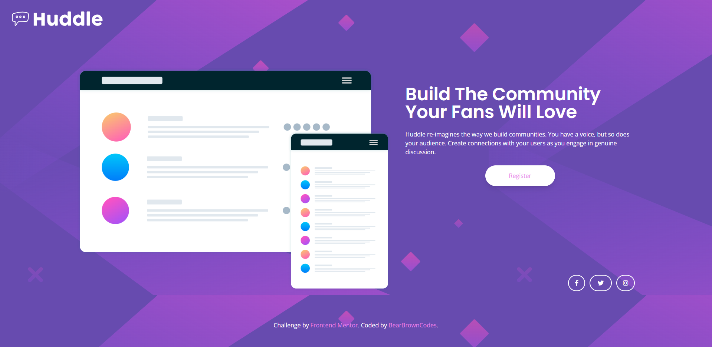

# Frontend Mentor - Huddle landing page with single introductory section solution

This is a solution to the [Huddle landing page with single introductory section challenge on Frontend Mentor](https://www.frontendmentor.io/challenges/huddle-landing-page-with-a-single-introductory-section-B_2Wvxgi0). Frontend Mentor challenges help you improve your coding skills by building realistic projects.

## Table of contents

- [Overview](#overview)
  - [The challenge](#the-challenge)
  - [Screenshot](#screenshot)
  - [Links](#links)
- [My process](#my-process)
  - [Built with](#built-with)
  - [What I learned](#what-i-learned)
  - [Useful resources](#useful-resources)
- [Author](#author)

## Overview

### The challenge

Users should be able to:

- View the optimal layout for the page depending on their device's screen size
- See hover states for all interactive elements on the page

### Screenshot

### Links

- Solution URL: [Add solution URL here](https://your-solution-url.com)
- Live Site URL: [Add live site URL here](https://your-live-site-url.com)

## My process

### Built with

- Semantic HTML5 markup
- TailwindCSS
- TailwindCSS Grid
- Mobile-first workflow

### What I learned

I have learned a bit more about Tailwind CSS, for example, I've learned how to position Items at the Bottom Screen and make them stay there.

### Useful resources

- [Tailwind CSS](https://tailwindcss.com) - This is the "framework" I have used.
- [Tailwind CSS Docs](https://tailwindcss.com/docs) - I used the TailwindCSS Docs when I was stuck at a problem.
- [Stackoverflow](https://stackoverflow.com/) - I've also researched some stuff on Stackoverflow.

## Author

- Frontend Mentor - [@bearbrowncodes](https://www.frontendmentor.io/profile/bearbrowncodes)
